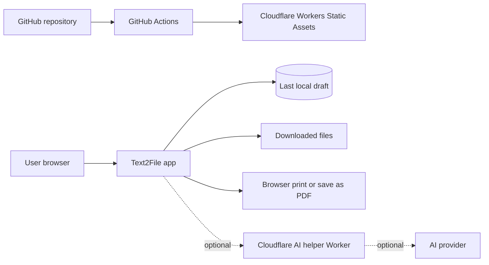

# Architecture

## Hosting

Production targets Cloudflare Workers Static Assets so the project can start as a static React app and later add protected API routes for AI assistance, rate limits, and bot checks.

GitHub remains the open-source home for code review, CI, issues, and releases.

## High-Level Flow

## App Boundaries

- `apps/web` owns the browser experience.
- `packages/document-schema` will own a portable document model.
- `packages/export-engine` will own PDF, DOCX, HTML, Markdown, and TXT conversion.
- `packages/language-data` will own dictionaries and local writing rules.
- `apps/assist-worker` will be added only when AI features are ready.

## Non-Goals for the First Release

- User accounts.
- Cloud document storage.
- Collaborative editing.
- Always-on AI processing.
- Uploading document text to analytics.
